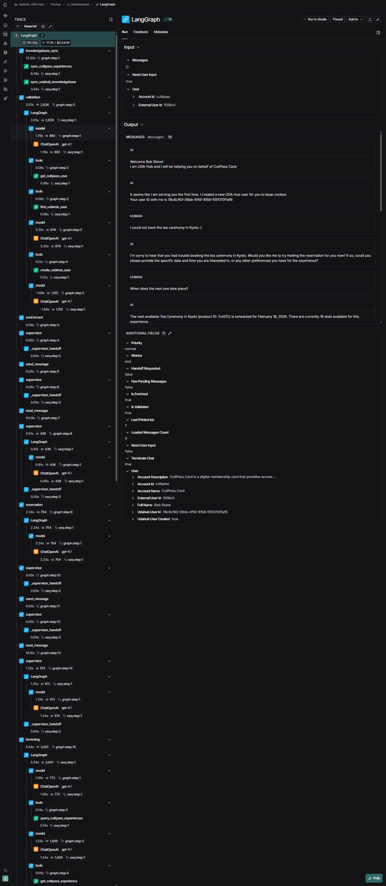

#### ND901 - Agentic AI Engineer with LangChain and LangGraph

# Project 3: Autonomous Knowledge Agent

UDA-Hub, a Universal Decision Agent, is an a Help Desk assistant driven by agentic AI. 
It is designed to plug into existing systems and help the users of those systems with their help desk requests.
UDA-Hub achieves this by accessing both UDA-Hub's internal knowledgebase and external tools that connect to the systems used by the customers.
A wide range of predefined worker agents is provided by UDA-Hub, but each customer can define which agents are plugged into their instance of UDA-Hub, defining what the agent is capable of doing for their users.

### Showcase: Cultpass Card

In this project the concept is demonstrated with a fictional travel experience company called Cultpass Card, which offers various travel experiences to its customers.
Users holding a subscription to the Cultpass Card can book these experiences. Cultpass offers two subscription tiers: Standard and Premium. Premium allows the holder to book more exclusive experiences with less availability, while Standard offers a more limited selection.
Typical user requests are related to checking, modifying, or cancelling reservations, changing, continuing or cancelling subscriptions, and asking for recommendations on which experience to book next based on the user's preferences and past bookings.
Of course there are also more general FAQ-type questions that users might have, which can be answered by the agent as well.

### Architecture

UDA-Hub provisions an architecture that allows customers to plug into UDA-Hub and delegate help desk requests to the agent, which can then use the tools provided by the customer to perform the necessary actions to resolve the user's request.


### Short-term Memory

The UDA-Hub Chat Agent utilizes an in-memory checkpointing mechanism. That means as long as the session has not been terminated, it allows any user to continue a conversation without losing context even after terminating the chat.
This also allows faster response times as the agent does not need to go through the overhead of validating the user and retrieving context from long-term memory on every single request.

### Long-term Memory

Additionally, UDA-Hub also stores the conversation history in a persistent store encapsulated in tickets. 
Using the ticket ID, a user can continue long-running conversations even after the in-memory checkpoint has been terminated.

### Learning and Knowledge Growth

Upon completion of a ticket UDA-Hub also tries to extract new learnings from the conversation and stores these in a knowledgebase.
This allows the agent to grow its knowledge over time and provide better answers to the users.

## Prerequisites

This project is set up on top of the python tooling of [Astral.sh](https://astral.sh/), escpecially their package manager `uv`. If you have it already installed you can set up this project and install all dependencies by running the following command inside the root folder.

```bash
uv sync
``` 

Make sure to validate that the virtual environment is activated after installing the dependencies. 
If it's not activated, you can activate it with the following command:

```bash
source .venv/bin/activate
```

### DB Setup

Before running UDA-Hub, you need to set up the necessary databases by running the jupyter notebooks [01_external_db_setup.ipynb](starter/01_external_db_setup.ipynb) and [02_core_db_setup.ipynb](starter/02_core_db_setup.ipynb) located in the [starter](starter) folder.
Afterwards you should find two SQLite database files in the [starter/data](starter/data) folder: `core/udahub.db` and `external/cultpass.db`.

## Running UDA-Hub

In order to run UDA-Hub, you need to start the MCP servers (see [MCP Servers](#mcp-servers)) first so that the agtents have access to all the necessary tools.
Run each of these commands in separate terminal windows to maintain visibility on the logs of each server:

```bash
python -m starter.mcp_servers.udahub_mcp
python -m starter.mcp_servers.knowledgebase_mcp
python -m starter.mcp_servers.cultpass_mcp
```

Alternatively, you can run all MCP servers in the background with the following commands and then use `wait` to keep the terminal open:

```bash
python -m starter.mcp_servers.udahub_mcp & 
python -m starter.mcp_servers.knowledgebase_mcp & 
python -m starter.mcp_servers.cultpass_mcp &

wait
```

After starting the MCP servers, you can play can set up the agent and start the chat loop with the following code:
```python
from starter.agentic.udahub import UdaHubAgent, McpServerList
from langchain_mcp_adapters.client import StreamableHttpConnection

if __name__ == "__main__":
    # The mcp server(s) of the customer support system(s) the agent should interact with.
    mcp_servers = McpServerList().add_connection(
        "cultpass",
        StreamableHttpConnection(
            url="http://localhost:8003/mcp", transport="streamable_http"
        ),
    )

    # Initialize the agent with the mcp server connections
    agent = UdaHubAgent(mcp_servers)

    # Start the agent's chat loop
    agent.start_chat(
        account_id="cultpass",
        exteranal_user_id="f556c0",
        thread_id="USER_THREAD_ID",
    )
```

### Chat Interface

In order to allow simple interactions with the agent, three different chat interfaces are provided in the in [chat_interface.py](starter/agentic/chat_interface.py).

The most basic one is a simple command line interface, which allows you to send messages to the agent and receive responses in the terminal. This is also the default interface that is used when you run the `UdaHubAgent` with the `start_chat` method.

```python
    # [...]
    from starter.agentic.chat_interface import ConsoleChatInterface

    chat_interface = ConsoleChatInterface()

    # Start the agent's chat loop
    agent.start_chat(
        account_id="cultpass",
        exteranal_user_id="f556c0",
        thread_id="USER_THREAD_ID",
        chat_interface=chat_interface,
    )
```

For debugging purposes, there is the ListChatInterface, which holds a list of predefined messages, that will be given to the agent upon request.

```python
    # [...]
    from starter.agentic.chat_interface import ListChatInterface

    predefined_messages = [
        "Hello, I would like to book an experience.",
        "Can you recommend something for me?",
        "I would like to cancel my subscription.",
    ]
    chat_interface = ListChatInterface(predefined_messages)

    # Start the agent's chat loop
    agent.start_chat(
        account_id="cultpass",
        exteranal_user_id="f556c0",
        thread_id="USER_THREAD_ID",
        chat_interface=chat_interface,
    )
```

For complex testing and benchmarking, there is the LlmChatInterface, which uses a language model to generate messages for the agent based on a predefined instructions prompt.

```python
    # [...]
    from starter.agentic.chat_interface import LlmChatInterface
    from langchain_openai import ChatOpenAI

    llm = ChatOpenAI(
        model="gpt-4.1",
        temperature=0.0,
    )
    chat_interface = LlmChatInterface(
        llm=llm,
        instructions="You want to book a cultural experience in Sao Paulo, Brazil. "
        "You like to dance. You are not willing to upgrade your subscription tier. "
        "In case there is no suitable non-premium experience available, you want to end the conversation.",
    )

    # Start the agent's chat loop
    agent.start_chat(
        account_id="cultpass",
        exteranal_user_id="f556c0",
        thread_id="USER_THREAD_ID",
        chat_interface=chat_interface,
    )
```


## Showcase

There is a detaied showcase of the project in the form of a Jupyter notebook available here: [showcase.ipynb](showcase.ipynb).

## Environment Variables

| Variable | Default | Description |
| --- | --- | --- |
| `OPENAI_API_KEY` | (required) | API key used by `langchain_openai.ChatOpenAI` (required to run the agent). |
| `UDAHUB_DB_PATH` | `sqlite:///starter/data/core/udahub.db` | SQLAlchemy connection string for the UDA Hub core database (used by the UDA Hub MCP server and DB helpers). |
| `CULTPASS_DB_PATH` | `sqlite:///starter/data/external/cultpass.db` | SQLAlchemy connection string for the Cultpass external database (used by the Cultpass MCP server and knowledgebase sync). |
| `CHROMA_DB_PATH` | `./chroma_data` | Filesystem path for the persistent ChromaDB store (used by the knowledgebase MCP server). |
| `UDAHUB_MCP_PORT` | `8001` | Port for the UDA Hub MCP server HTTP transport. |
| `KNOWLEDGE_BASE_MCP_PORT` | `8002` | Port for the Knowledgebase MCP server HTTP transport. |
| `CULTPASS_MCP_PORT` | `8003` | Port for the Cultpass MCP server HTTP transport. |

## Tracing and Observability

This project is instrumented with [LangSmith](https://langsmith.com) for tracing and observability. To enable tracing, you need to provide the necessary setup via environment variables.



| Variable | Default | Description |
| --- | --- | --- |
| `LANGSMITH_TRACING` | (unset / `false`) | Enable or disable tracing (set to `true` to turn tracing on). |
| `LANGSMITH_API_KEY` | (required for tracing) | LangSmith API key used to authenticate trace uploads. |
| `LANGSMITH_ENDPOINT` | (LangSmith default) | Optional custom endpoint (useful for EU region or self-hosted LangSmith). |
| `LANGSMITH_PROJECT` | (LangSmith default) | Optional project name to group traces (e.g. `Development`). |
